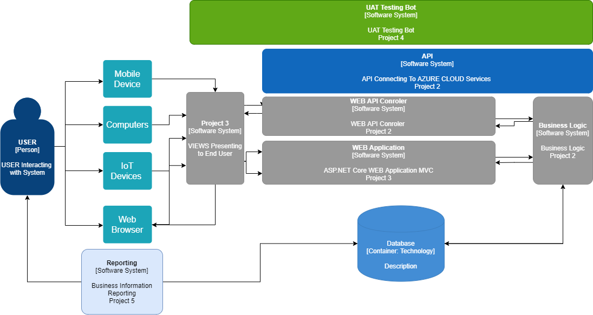

# CMPG-323-Overview-34875255
CMPG 323 Overview

## constuct Project goals

### setup Lables

### Setup Mile stones

## create Repositories
The Following Repositories will be required for the 5 Phases of building our IoT device capturing system

**- CMPG 323 Overview**

**- CMPG 323 Project 2** API to handle sending and receiving of data from IoT devices to the database

**- CMPG 323 Project 3** Construction of an ASP.Net Core MVC Web Application which will make use of the API to send data to and   from database

**- CMPG 323 Project 4** UAT testing is an important part of finalizing hour project. We will be constructing an Automation system that can perform Repetitive UAT testing tasks, to speed up the incisal UAT process
  
**- CMPG 323 Project 5** No Application is ever complete until reporting is done- project 5 we will be constructing some reports to deliver data as Business information whereby the end users and owners of the system can make well informed decision.

## Structure of Project 

**Project 1 Overview** - outlining the 5 projects and there milestones. it will also consist of all the planning documents and structure layouts.

**Project 2 Constructing an API** - to handle data transfer from database to the IoT Devices. it will interface with the database and the web application or the front end of our application.

**Project 3 constructing the front end** - It will be the entry point for Users and IoT devices. Furthermore, it will interface with the database by sending to and receiving data from the API.

**Project 4 is UAT testing** - normally this would be done by a user performing repetitive task to find bugs/ errors within the application. also test the interface if it is user friendly.

**Project 5** - maybe the most important step for me is reporting. an application is only as good as the Business information that can be gained. the report will be generated directly from the database will not be interfacing through the API.

## Branching Strategies
Some of the most common branching strategies are
GitFlow
GitHub Flow
GitLab Flow
Trunk-based development

Git flow is complex branching strategy consisting of branches for
- Master
- Develop
- Feature new features branching of the develop branch
- Release - help prepare a production release
- Hotfix branch
due to the many different branches, it is  complex and not suited for hour purpose

Github Flow 
Is a much simpler approach where Branches are made for new features and then merge back to the main, and the branch is then deleted.
This is an approached that I used last year’s project, and it worked well. there are problems doing it this way, it is important that developers communicate to what they are working on, to minimize conflicts when merging.

GitLab Flow
More used for big production environments where multiple levels are held of the software. branches are made and immediately afterwards, other teams will continue working on the main. these branches are pointed to dev environments.
Will not be using a strategy like this, due to the cost implication of having different servers for different environments. I'm a one-man team for this project.

Trunk-Based 
A strategy that is not really a branching strategy but rather trunks into the main project. Meaning the main project is almost always up to date.

MY STRATIGY
I will be combining the Idees from Github flow and Gitlab Flow. in this project the developer will create a branch for each sprint/section. After that section is done it will be merged. this way the main is always available to fall back to and the main is always updated before the next Brach is made. after each Brach is merged, that Brach will be deleted.

##.gitignore file
* Common Use you will ignore files and folders like:
 * Log Files
 * Files with API Keys/Secrets, credential, and sesnsitive information
 * Some systemfiles like .DS_Store on MacOs
 * generated files like dist folders
 * and personal use like a todo list or some form of track record you kepping seprate
 
###Project 2 and project 3
I will mainly focus on Ignoring credentials, API Keys/Secrets and visual studio files like
* *.suo
* *.user
* *.userosscache
* *.sln.docstates
* .vs/
* msbuild.log*
* msbuild.err
* msbuild.wrn
* .vscode

## Project and Repository Structure
Maybe add diagram to better see my child

