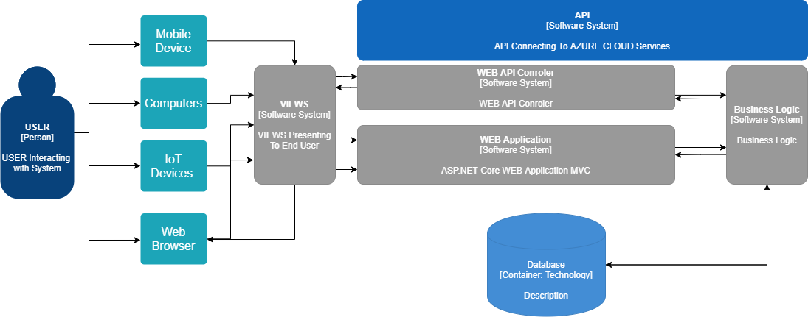

# CMPG-323-Overview-34875255
CMPG 323 Overview

## constuct Project goals

### setup Lables

### Setup Mile stones

## create Repositories
The Following Repositories will be required for the 5 Phases of building our IoT device capturing system

**- CMPG 323 Overview**

**- CMPG 323 Project 2** API to handle sending and receiving of data from IoT devices to the database

**- CMPG 323 Project 3** Construction of an ASP.Net Core MVC Web Application which will make use of the API to send data to and   from database

**- CMPG 323 Project 4** UAT testing is an important part of finalizing hour project. We will be constructing an Automation system that can perform Repetitive UAT testing tasks, to speed up the incisal UAT process
  
**- CMPG 323 Project 5** No Application is ever complete until reporting is done- project 5 we will be constructing some reports to deliver data as Business information whereby the end users and owners of the system can make well informed decision.

## Structure of Project 

## Branching Strategies
Diagram

## Project and Repository Structure
Maybe add diagram to better see my child

